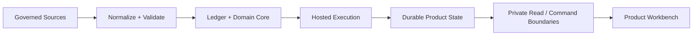
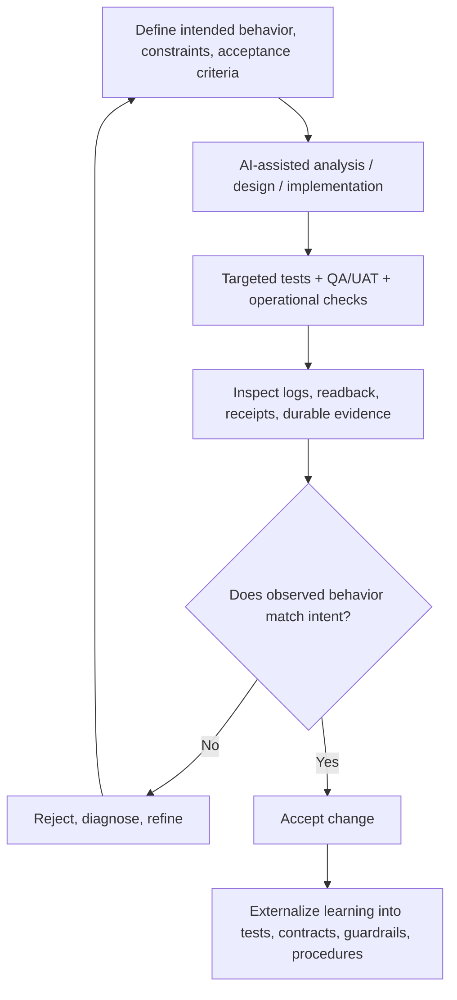
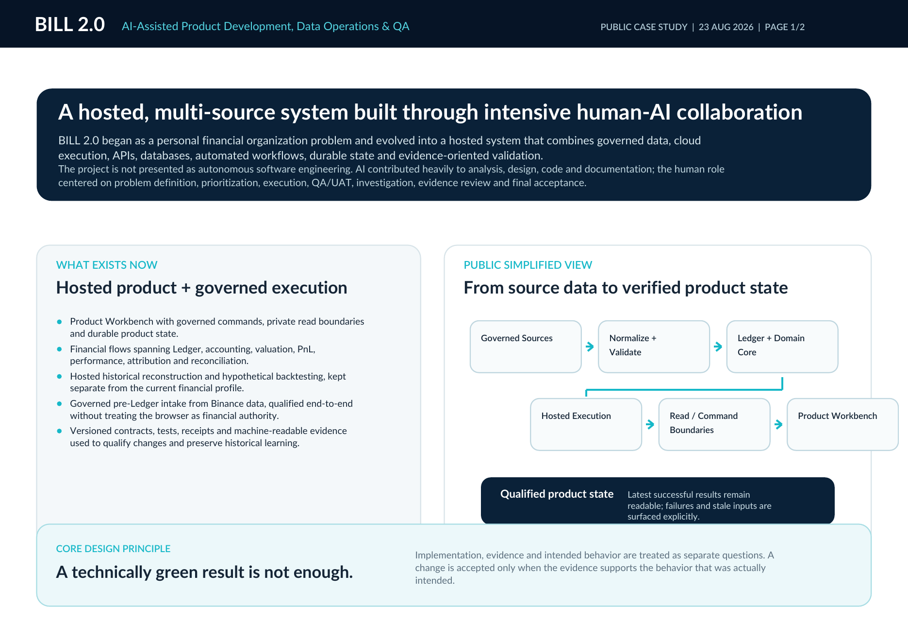
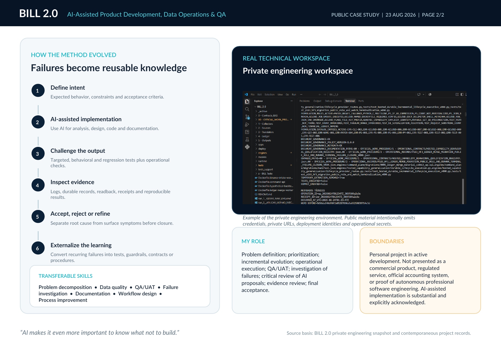

# BILL 2.0

**AI-Assisted Product Development, Data Operations & QA**

BILL 2.0 is an independent AI-assisted software project that evolved from a personal financial organization problem into a hosted, multi-source system integrating governed data, APIs, databases, cloud execution, automated workflows, durable product state, and evidence-oriented validation.

This public repository is a **recruiter-safe case study**, not the private engineering repository. It intentionally excludes source code, credentials, private URLs, deployment identities, operational secrets, and raw financial data.

## What the system does

At a high level, BILL 2.0 moves governed source data through deterministic domain processing and hosted execution into a durable product state exposed through controlled read and command boundaries.

The system includes, among other capabilities:

- governed source intake and structured data normalization;
- Ledger-based accounting and financial state derivation;
- valuation, PnL, performance, attribution, and reconciliation flows;
- hosted historical reconstruction and hypothetical backtesting;
- governed pre-Ledger intake and merge workflows;
- a hosted Product Workbench for controlled operations and durable readback;
- versioned contracts, tests, receipts, and machine-readable evidence.

The browser is deliberately **not** the financial authority: canonical calculations, state, and governance remain outside the UI layer.

## How the development process works

The project is developed through an incremental human-AI loop rather than by accepting AI-generated output directly.

A technically green result is not automatically accepted. Implementation, evidence, and intended behavior are treated as separate questions.

## Traceability by design

A central design principle is that governed implementation and execution paths materialize **machine-readable, immutable, and traceable receipts or operational records**.

These records are used to preserve evidence such as:

- what was requested;
- which versioned input or change was used;
- which checks and boundaries were applied;
- what actually executed;
- whether a provider boundary was crossed;
- which artifacts were produced;
- whether the result was accepted, rejected, stale, or failed;
- how a later investigation or recovery can refer back to the exact prior state.

Two sanitized, illustrative examples are included in [`examples/`](examples/). They show the public shape of this idea without exposing private operational data.

## My role

My role is not presented as autonomous professional software engineering. AI contributes substantially to analysis, design, code generation, refactoring, and documentation.

My contribution focuses on:

- defining the problem, intended behavior, constraints, and acceptance criteria;
- prioritizing and sequencing incremental changes;
- critically reviewing AI-generated proposals and implementations;
- executing and interpreting QA/UAT, targeted tests, regression checks, and live operational evidence;
- investigating mismatches between technically successful output and intended behavior;
- distinguishing root causes from surface symptoms;
- preserving traceability, reproducibility, and recoverability;
- converting recurring failures into reusable tests, guardrails, contracts, or procedures;
- making the final accept / reject / refine decision from evidence.

## Validation principles that emerged from the project

As BILL 2.0 evolved, several operating principles became explicit parts of the development method:

intended behavior is defined separately from implementation;
technically successful execution is not sufficient evidence of correctness;
acceptance depends on reproducible tests, operational evidence, and observed behavior;
uncertain or incomplete evidence remains explicitly unresolved rather than being silently inferred;
recurring failures are converted into reusable tests, contracts, guardrails, or procedures;
state and evidence are preserved so later sessions can investigate, reproduce, recover, and continue the work without reconstructing prior reasoning from memory.

## Public case study

The two-page public case study summarizes the architecture, development method, role boundaries, and transferable skills.

**[Open the PDF case study](docs/BILL_2_0_Public_Case_Study.pdf)**

## Public architecture & method note

A slightly deeper, still non-sensitive explanation is available in:

**[Architecture and method](docs/ARCHITECTURE_AND_METHOD.md)**

## Boundaries

This is a public portfolio artifact for a private project in active development.

It is **not** presented as:

- a commercial product;
- a regulated financial service;
- an official accounting system;
- an open-source release of the private codebase;
- proof of autonomous professional software engineering.

Public material intentionally omits credentials, private URLs, provider/project identities, raw financial data, and operational secrets.

---

**Tomaz Ricco Lamac**  
Operations | Data Quality | AI-Assisted Workflows | Process Improvement  
LinkedIn: https://www.linkedin.com/in/tomaz-lamac/
